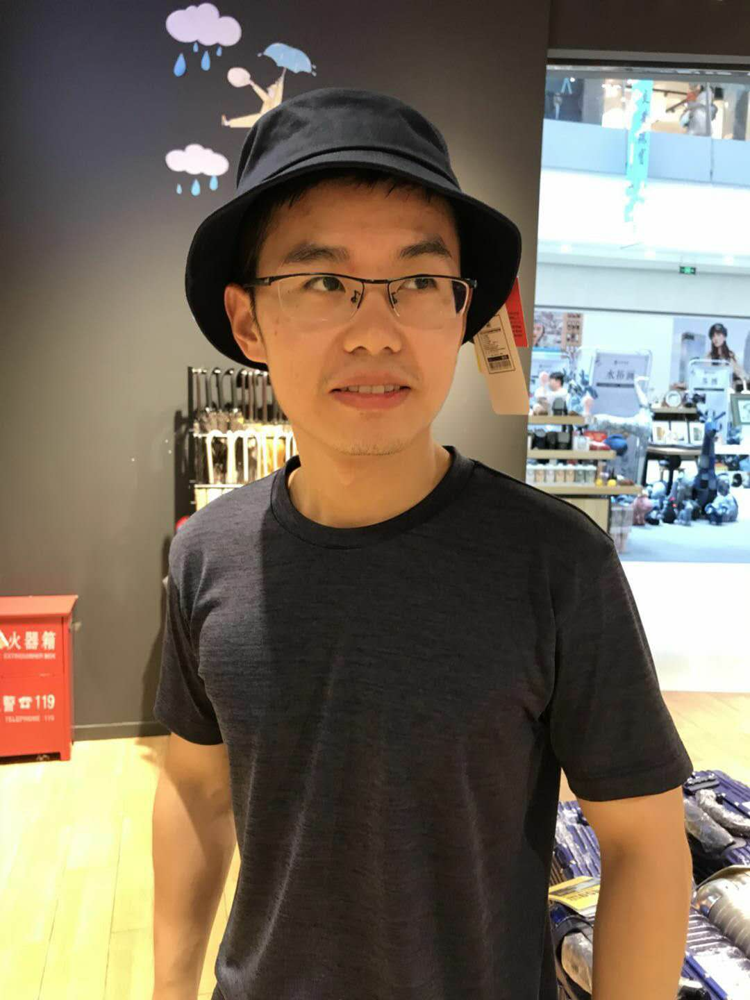

<html >
<body>

<table>
	<tbody>
		<tr>
			<td width="670">
				
					
					<h1>蒲浩</h1><h1>
				</h1>

				<h3>硕士研究生</h3>
				

					中国科学院大学 
					中国科学院空间应用工程与技术中心 
					北京市海淀区邓庄南路9号 
					 
					Email: puhao18@csu.ac.cn 
				

				
 
					
					
					
					
				

			</td>
			<td>
				 
			</td>
		</tr><tr>
	</tr></tbody>
</table>

<h2>个人简介</h2>

	我是来自<a href="https://www.ucas.ac.cn/">中国科学院大学</a>的硕士研究生。 此前，我已在<a href="https://www.ustb.edu.cn/">北京科技大学</a>机械工程学院取得工学学士学位。

	我现在的工作是对微重力落塔的实验舱的释放方式探索，目前，通过电磁力实现舱体的悬浮然后再对电磁力进行适当的曲线规划简历释放模型，模拟释放实验现象。

 

	如果你对我的研究感兴趣，请通过邮件与我联系。

<h2>项目经历</h2>
<ul>
	<li>
		
微重力落塔舱体电磁悬浮释放项目
 
2019.08
 
		使用SolidWorks进行三自由度电磁悬浮释放模型的设计 
		利用刚体动力学，对三自由度电磁释放模型进行动力学分析，并对模型进行解耦和线性化 
		使用Simulink对线性解耦后的模型进行控制仿真，实现电磁悬浮 
		根据项目释放指标，规划目标舱体释放曲线，使用Simulink进行轨迹仿真 
		在重力环境下实现了在0.15s内的电磁悬浮释放，有效提高了释放水平 
	</li>
	<li>
		
校摇篮杯
 
2017.04
 
		使用CAD进行的对地侦察航模机械部分的设计及制作部分的书写 
 		进行每一代版本的比较和创新说明 
 		获得校摇篮杯三等奖 
	</li>
	<li>
		
校内机器人比赛
 
2017.05
 
		使用SolidWorks三维建模软件，进行手动机器人和自动机器人的模型设计以及相关制作 
 		使用CCD传感器进行路径识别，使用红外传感器进行机器人避障 
 		担任小组组长，定期总结小组进程，规划比赛过程中的任务及目标 
 		获得校机器人二等奖 
	</li>
	<li>
		
SRTP可携带可折叠后对式襟翼项目
 
2016.11
 
		使用CAD绘图软件，设计可携带可折叠后对式襟翼结构 
 		担任小组组长，负责研究报告的总结及项目的进展及规划 
	</li>
	<li>
		
航空航天模型锦标赛
 
2016.10
 
		使用CAD绘图软件，负责机身图纸的绘制以及制作 
 		使用硬件控制电路，控制航模在飞行过程中自动矫正 
 		操控摄像头云台，识别地面靶标数字 
 		获得中国航空航天模型锦标赛一等奖 
	</li>
</ul>

<h2>荣誉与奖项</h2>
<table style="border-spacing:2px">
	
	<tbody>		
		<tr><td>国家励志奖学金，2018</td></tr>
		<tr><td>优秀三好学生，2018</td></tr>
		<tr><td>国家励志奖学金，2017</td></tr>
		<tr><td>优秀三好学生，2017</td></tr>
		<tr><td>校摇篮杯三等奖，2017</td></tr>
		<tr><td>校机器人二等奖，2017</td></tr>
		<tr><td>国家励志奖学金，2016</td></tr>
		<tr><td>优秀三好学生，2016</td></tr>
		<tr><td>中国航空航天模型锦标赛一等奖，2016</td></tr>
		<tr><td>全国部分地区北京赛区物理竞赛三等奖，2016</td></tr>
		<tr><td>校数学竞赛二等奖，2015</td></tr>
		<tr><td>优秀三好学生，2015</td></tr>
		<tr><td>国家励志奖学金，2015</td></tr>		
	</tbody>
</table>

</body></html>
